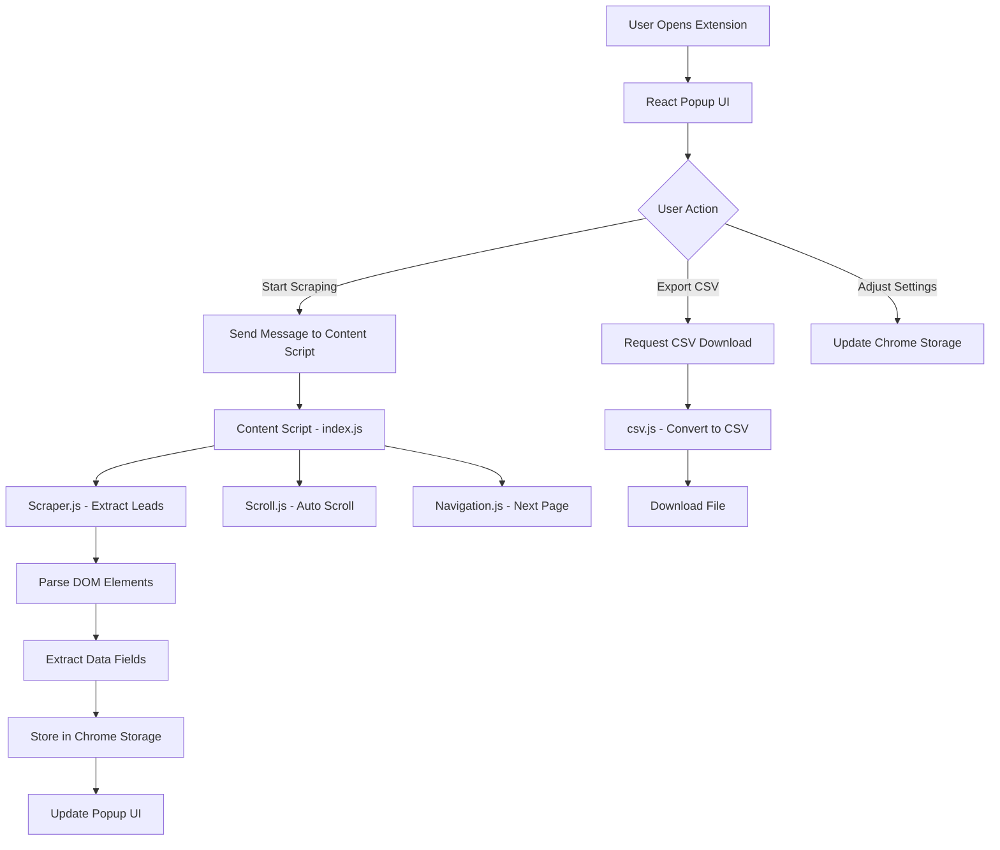

# 🎯 LeadRadar - Google Maps Lead Extractor

<div align="center">


**Discover Business Leads Instantly**

*Extract unlimited leads from Google Maps with one click*

[Features](#-features) • [Installation](#-installation) • [Usage](#-usage) • [Use Cases](#-use-cases) • [FAQ](#-faq)

</div>

---

## 📖 Product Description

**LeadRadar** is a professional-grade Chrome extension designed to revolutionize how businesses collect B2B leads from Google Maps. Built with modern React technology and a stunning user interface, this tool extracts comprehensive business information including names, phone numbers, websites, ratings, reviews, addresses, coordinates, and more—all in real-time.

Whether you're a digital marketer, sales professional, recruiter, or business owner, this extension enables you to build targeted prospect lists in minutes instead of hours. No subscriptions, no rate limits, and complete control over your data extraction process.

### 🎯 Why Choose This Extension?

- **💯 100% Free & Open Source** - No hidden fees, no subscriptions
- **🚀 Unlimited Scraping** - Extract as many leads as you need
- **🎨 Modern UI** - Beautiful, intuitive interface with dark mode
- **🔒 Privacy-Focused** - All data stays on your device
- **⚡ Real-Time Extraction** - Watch leads populate instantly
- **📊 Advanced Features** - Data table, filtering, history tracking, and export options
- **🤖 Human-Like Behavior** - Avoid detection with smart delays and natural scrolling
- **💾 Persistent Storage** - Never lose your scraped data

---

## ✨ Features

### 🔥 Core Features

#### **One-Click Lead Extraction**
Start scraping with a single click. The extension automatically detects Google Maps search results and begins extracting lead information in real-time.

#### **Comprehensive Data Extraction**
Each lead includes:
- **Business Name** - Official business name
- **Phone Number** - Contact number
- **Website URL** - Business website
- **Rating** - Star rating (1-5)
- **Reviews Count** - Number of reviews
- **Status** - Open/Closed status
- **Address** - Physical location
- **Coordinates** - Latitude and longitude
- **Google Maps URL** - Direct link to listing
- **Services** - Available services (dine-in, delivery, etc.)
- **Image** - Business thumbnail
- **Search Keyword** - Your original search term

#### **Intelligent Auto-Scroll**
Automatically scrolls through Google Maps results to load more listings, ensuring you capture all available leads without manual intervention.

#### **Auto Next Page Navigation**
Seamlessly moves to the next page of results when available, enabling comprehensive market coverage.

#### **Smart CSV Export**
Download your leads with intelligent file naming:
- Format: `search-keyword-YYYY-MM-DD.csv`
- Includes all extracted fields
- Ready for CRM import or analysis

#### **Interactive Data Table**
- **View** all scraped leads in an organized table
- **Filter** by name, phone, or website
- **Sort** by any column
- **Copy** selected rows to clipboard
- **Real-time updates** as scraping progresses

#### **History Tracking**
Automatically logs all scraping sessions with:
- Timestamp
- Search keyword
- Number of leads extracted
- Quick session review

#### **Dark Mode**
Eye-friendly dark theme for comfortable night sessions and reduced eye strain.

### ⚙️ Advanced Settings

#### **Human-Like Behavior**
Adds random delays between actions to mimic natural browsing patterns and avoid detection.

#### **Auto-Scroll Toggle**
Enable or disable automatic scrolling based on your needs.

#### **Auto Next Page Toggle**
Control whether the extension should automatically navigate to subsequent result pages.

### 📊 Real-Time Dashboard

The dashboard provides instant insights:
- **Total Leads Scraped** - Live count with visual indicator
- **Pages Processed** - Number of result pages scraped
- **Session Time** - Elapsed time in MM:SS format
- **Latest Lead Preview** - Real-time display of most recently scraped lead
- **Quick Action Buttons** - Start, stop, export, and clear data controls

---

## 🎯 Use Cases

### 1. **B2B Lead Generation**
Build targeted prospect lists for outbound sales campaigns:
- Search: "Software companies in San Francisco"
- Export leads with contact info
- Import to CRM for outreach

### 2. **Local Business Marketing**
Digital marketing agencies can find clients in specific niches:
- Search: "Restaurants without websites in Miami"
- Identify underserved businesses
- Pitch web design or SEO services

### 3. **Competitor Research**
Analyze competitor landscapes:
- Search: "Coffee shops in Seattle"
- Study ratings, reviews, and locations
- Identify market gaps

### 4. **Recruitment & Hiring**
Recruiters can find companies in specific industries:
- Search: "Construction companies in Texas"
- Extract contact information
- Reach out to hiring managers

### 5. **Event Planning**
Gather vendor information:
- Search: "Catering services in Chicago"
- Compare ratings and reviews
- Build a shortlist for client proposals

### 6. **Market Research**
Researchers and analysts can collect data:
- Search: "Gyms in London"
- Analyze density, ratings, and services
- Generate insights and reports

### 7. **Franchise Development**
Identify expansion opportunities:
- Search: "Fast food restaurants in Dallas"
- Analyze market saturation
- Find underserved areas

### 8. **Partnership Outreach**
Find collaboration opportunities:
- Search: "Co-working spaces in Austin"
- Extract contact details
- Propose partnerships

### 9. **Investment Research**
Investors can scout opportunities:
- Search: "New restaurants in Toronto"
- Analyze reviews and trends
- Identify promising businesses

### 10. **Customer Support Data Collection**
Collect service provider information:
- Search: "Plumbers in Phoenix"
- Build customer service directories
- Create referral networks

---

## 📦 Installation

### Method 1: Install from Source (Recommended)

1. **Clone or Download** this repository:
   ```bash
   git clone https://github.com/brandspiritlabs/google-maps-leads-scraper.git
   cd google-maps-leads-scraper/maps-scraper-extension
   ```

2. **Install dependencies**:
   ```bash
   npm install
   ```

3. **Build the extension**:
   ```bash
   npm run build
   ```
   This creates an optimized production build in the `dist/` folder.

4. **Load in Chrome**:
   - Open Chrome and navigate to `chrome://extensions/`
   - Enable **Developer mode** (toggle in top right)
   - Click **Load unpacked**
   - Select the `dist` folder from the project directory

5. **Verify installation**:
   - The extension icon should appear in your Chrome toolbar
   - Click the icon to ensure the popup opens correctly

### Method 2: Development Mode

For developers who want to modify the extension:

1. **Follow steps 1-2 from Method 1**

2. **Run in development mode**:
   ```bash
   npm run dev
   ```
   This starts Vite's hot-reload development server.

3. **Load unpacked** from the `dist` folder as described above
   - Changes will auto-reload in the extension

---

## 🚀 Usage

### Quick Start Guide

1. **Navigate to Google Maps**
   - Go to [https://www.google.com/maps](https://www.google.com/maps)

2. **Search for Businesses**
   - Enter your search query (e.g., "Dentists in New York")
   - Wait for results to load

3. **Open the Extension**
   - Click the extension icon in your Chrome toolbar
   - The popup interface will open

4. **Start Scraping**
   - Click the **"Start Scraping"** button
   - Watch leads populate in real-time on the dashboard

5. **Monitor Progress**
   - View the stats dashboard for live counts
   - See the latest lead in the preview section

6. **Stop When Ready**
   - Click **"Stop Scraping"** when you have enough leads
   - Or let it run until all results are processed

7. **Export Your Data**
   - Click **"Export CSV"** to download your leads
   - File will be named: `your-search-keyword-YYYY-MM-DD.csv`

### Advanced Workflow

#### Viewing Data Table
1. Click the **"Data"** tab at the top
2. Browse all scraped leads in table format
3. Use the search box to filter results
4. Click column headers to sort
5. Select rows and click **"Copy Selected"** to copy to clipboard

#### Reviewing History
1. Click the **"History"** tab
2. View all past scraping sessions
3. See keyword, lead count, and timestamp for each session

#### Adjusting Settings
1. Scroll down on the Dashboard tab
2. Toggle settings:
   - **Human-like Behavior**: Adds random delays
   - **Auto-Scroll**: Automatically scrolls results
   - **Auto Next Page**: Moves to next page when available
   - **Dark Mode**: Toggles dark theme

#### Clearing Data
1. Click the **"Clear Data"** button on the dashboard
2. Confirm the action
3. All scraped leads and stats will be reset

---

## 📊 Exported Data Format

The CSV export includes the following columns:

| Column | Description | Example |
|--------|-------------|---------|
| **Keyword** | Your search term | "Plumbers in London" |
| **Name** | Business name | "Smith's Plumbing Services" |
| **Phone** | Contact number | "+1 555-123-4567" |
| **Website** | Business URL | "https://smithplumbing.com" |
| **Rating** | Star rating (1-5) | "4.5" |
| **Reviews** | Review count | "230" |
| **Status** | Open/Closed | "Open" |
| **Address** | Physical location | "123 Main St, London" |
| **Latitude** | GPS coordinate | "51.5074" |
| **Longitude** | GPS coordinate | "-0.1278" |
| **Google Maps URL** | Direct link | "https://www.google.com/maps/place/..." |
| **Services** | Available services | "Delivery, In-store pickup" |
| **Image** | Thumbnail URL | "https://lh5.googleusercontent.com/..." |

---

## 🛠️ Technical Architecture

### Technology Stack

- **Frontend Framework**: React 19.2.0
- **Build Tool**: Vite 7.2.4
- **UI Framework**: Tailwind CSS 3.4.17
- **Icons**: Lucide React
- **Chrome Extension**: Manifest V3
- **Storage**: Chrome Storage API
- **Scripting**: Chrome Content Scripts

### Project Structure

```
maps-scraper-extension/
├── public/
│   ├── manifest.json          # Chrome extension manifest
│   ├── icon-16.png            # Extension icon (16x16)
│   ├── icon-48.png            # Extension icon (48x48)
│   └── icon-128.png           # Extension icon (128x128)
├── src/
│   ├── content/               # Content scripts (injected into Google Maps)
│   │   ├── index.js           # Main content script controller
│   │   ├── scraper.js         # Lead extraction logic
│   │   ├── scroll.js          # Auto-scroll functionality
│   │   ├── navigation.js      # Next page navigation
│   │   └── csv.js             # CSV conversion and download
│   ├── popup/                 # Extension popup UI
│   │   ├── App.jsx            # Main React app component
│   │   ├── main.jsx           # React entry point
│   │   ├── index.css          # Global styles and Tailwind
│   │   └── components/        # React UI components
│   │       ├── Header.jsx         # Header with title and status
│   │       ├── StatsDashboard.jsx # Stats display
│   │       ├── ResultsPreview.jsx # Latest lead preview
│   │       ├── Controls.jsx       # Control buttons
│   │       ├── Settings.jsx       # Settings toggles
│   │       ├── ResultsTable.jsx   # Data table view
│   │       ├── History.jsx        # History log
│   │       ├── Footer.jsx         # Footer with branding
│   │       └── Toast.jsx          # Toast notifications
│   └── assets/                # Static assets
├── dist/                      # Production build (generated)
├── package.json               # NPM dependencies
├── vite.config.js             # Vite configuration
├── tailwind.config.js         # Tailwind CSS configuration
└── README.md                  # This file
```

### Architecture Overview



### Key Components

#### **Content Script (src/content/index.js)**
- Injected into Google Maps pages
- Listens for messages from popup
- Orchestrates scraping loop
- Manages state and storage

#### **Scraper Module (src/content/scraper.js)**
- DOM parsing and data extraction
- Handles various Google Maps layouts
- Extracts 13+ data fields per lead
- Robust error handling

#### **Popup UI (src/popup/App.jsx)**
- React-based user interface
- Real-time state synchronization
- Three-tab layout (Dashboard, Data, History)
- Dark mode support

#### **Storage Strategy**
- Uses Chrome Storage API for persistence
- Real-time synchronization between popup and content script
- Deduplication using URL or name as key
- Session history tracking

---

## ⚡ Performance & Optimization

### Speed
- **Average extraction**: 2-3 seconds per lead
- **Human-like delays**: 1-2 seconds between actions
- **Batch processing**: Up to 100+ leads in under 5 minutes

### Memory
- **Lightweight design**: ~10MB memory footprint
- **Efficient storage**: Compressed lead data
- **No background processes**: Extension only runs when popup is open

### Reliability
- **Duplicate detection**: Prevents duplicate entries
- **Error recovery**: Continues scraping if individual items fail
- **Auto-save**: Data persists even if browser closes

---

## 🔒 Privacy & Security

### Data Privacy
- ✅ **All data stays local**: No data sent to external servers
- ✅ **No tracking**: Extension does not track your activity
- ✅ **No analytics**: Zero telemetry or usage statistics
- ✅ **Open source**: Code is fully transparent and auditable

### Permissions Explained

The extension requires the following permissions:

| Permission | Purpose |
|------------|---------|
| `activeTab` | Access current tab to inject content script |
| `scripting` | Execute scraping code on Google Maps pages |
| `storage` | Save scraped leads and settings locally |
| `https://www.google.com/maps/*` | Only works on Google Maps (no other sites) |

---

## 🎨 Screenshots

### Dashboard View
Clean interface with real-time stats, lead preview, and control buttons.

### Data Table View
View, filter, sort, and export all your scraped leads in a professional table layout.

### History View
Track all your scraping sessions with timestamps, keywords, and lead counts.

### Dark Mode
Eye-friendly dark theme for comfortable nighttime use.

---

## 🐛 Troubleshooting

### Common Issues

#### **Extension icon not appearing**
- Ensure you loaded the `dist` folder, not the root folder
- Check that Developer mode is enabled in `chrome://extensions/`
- Try reloading the extension

#### **Not scraping any leads**
- Verify you're on `https://www.google.com/maps` (not a different domain)
- Ensure search results are visible on the page
- Try refreshing the Google Maps page
- Check that auto-scroll is enabled in settings

#### **Missing phone numbers or websites**
- Some businesses don't provide this information publicly
- Try clicking individual listings to see if data appears
- The extension can only extract publicly visible data

#### **CSV export not working**
- Check browser download settings
- Ensure you have scraped at least one lead
- Try exporting again after a few seconds

#### **Extension crashes or becomes unresponsive**
- Stop scraping and reload the extension
- Clear extension data (click "Clear Data")
- Reload the extension in `chrome://extensions/`

---

## 📚 FAQ

### **Q: Is this extension free?**
**A:** Yes, 100% free and open source. No hidden fees or subscriptions.

### **Q: Are there any usage limits?**
**A:** No rate limits. Scrape as many leads as you need.

### **Q: Will Google block me for using this?**
**A:** The extension uses human-like behavior to mimic natural browsing. However, use responsibly and at reasonable intervals.

### **Q: Can I use this for commercial purposes?**
**A:** Yes, the MIT license allows commercial use. However, comply with Google's Terms of Service and data protection laws (GDPR, CCPA, etc.).

### **Q: Does this work on Google Maps mobile?**
**A:** No, this is a Chrome extension for desktop browsers only.

### **Q: Can I scrape multiple searches at once?**
**A:** No, the extension processes one search at a time. Complete one search before starting another.

### **Q: How do I update the extension?**
**A:** Pull the latest code from GitHub, run `npm run build`, and reload the extension in Chrome.

### **Q: Can I customize the fields extracted?**
**A:** Yes! Edit `src/content/scraper.js` to add or remove data fields. You'll need to rebuild the extension.

### **Q: Is the data 100% accurate?**
**A:** The extension extracts publicly visible data from Google Maps. Accuracy depends on the quality of business listings.

### **Q: Can I export to formats other than CSV?**
**A:** Currently only CSV is supported. You can modify `src/content/csv.js` to add JSON, Excel, or other formats.

---

## 🛠️ Development

### Prerequisites

- Node.js 16+ and npm
- Chrome browser
- Basic knowledge of React and JavaScript

### Setup Development Environment

```bash
# Clone repository
git clone https://github.com/brandspiritlabs/google-maps-leads-scraper.git
cd google-maps-leads-scraper/maps-scraper-extension

# Install dependencies
npm install

# Start development server
npm run dev
```

### Build for Production

```bash
npm run build
```

### Linting

```bash
npm run lint
```

### Development Tips

- **Hot Reload**: Use `npm run dev` for automatic reloading during development
- **Debugging**: Open Chrome DevTools → Console to view logs
- **Content Script Logs**: Inspect Google Maps page → Console
- **Popup Logs**: Right-click extension icon → Inspect Popup

---

## 🤝 Contributing

Contributions are welcome! Whether it's bug fixes, new features, documentation improvements, or UI enhancements, we appreciate your help.

### How to Contribute

1. **Fork the repository**
   ```bash
   git clone https://github.com/YOUR_USERNAME/google-maps-leads-scraper.git
   ```

2. **Create a feature branch**
   ```bash
   git checkout -b feature/amazing-feature
   ```

3. **Make your changes**
   - Write clean, documented code
   - Follow existing code style
   - Test thoroughly

4. **Commit your changes**
   ```bash
   git commit -m 'Add amazing feature'
   ```

5. **Push to your fork**
   ```bash
   git push origin feature/amazing-feature
   ```

6. **Open a Pull Request**
   - Describe your changes in detail
   - Reference any related issues

### Contribution Ideas

- 🎨 **UI/UX improvements**: Enhance the interface design
- 🌍 **Internationalization**: Add multi-language support
- 📊 **Export formats**: Add JSON, Excel, or database export options
- 🔍 **Advanced filters**: More sophisticated data filtering
- 📈 **Analytics**: Add data visualization and insights
- 🧪 **Tests**: Add unit and integration tests
- 📖 **Documentation**: Improve guides and tutorials

---

## 📄 License

This project is licensed under the **MIT License**.

```
MIT License

Copyright (c) 2026 Brand Spirit Labs

Permission is hereby granted, free of charge, to any person obtaining a copy
of this software and associated documentation files (the "Software"), to deal
in the Software without restriction, including without limitation the rights
to use, copy, modify, merge, publish, distribute, sublicense, and/or sell
copies of the Software, and to permit persons to whom the Software is
furnished to do so, subject to the following conditions:

The above copyright notice and this permission notice shall be included in all
copies or substantial portions of the Software.

THE SOFTWARE IS PROVIDED "AS IS", WITHOUT WARRANTY OF ANY KIND, EXPRESS OR
IMPLIED, INCLUDING BUT NOT LIMITED TO THE WARRANTIES OF MERCHANTABILITY,
FITNESS FOR A PARTICULAR PURPOSE AND NONINFRINGEMENT. IN NO EVENT SHALL THE
AUTHORS OR COPYRIGHT HOLDERS BE LIABLE FOR ANY CLAIM, DAMAGES OR OTHER
LIABILITY, WHETHER IN AN ACTION OF CONTRACT, TORT OR OTHERWISE, ARISING FROM,
OUT OF OR IN CONNECTION WITH THE SOFTWARE OR THE USE OR OTHER DEALINGS IN THE
SOFTWARE.
```

See [LICENSE](LICENSE) file for full details.

---

## 🔗 Links & Resources

- **Website**: [https://brandspiritlabs.com](https://brandspiritlabs.com)
- **GitHub Repository**: [https://github.com/brandspiritlabs/google-maps-leads-scraper](https://github.com/brandspiritlabs/google-maps-leads-scraper)
- **Report Issues**: [GitHub Issues](https://github.com/brandspiritlabs/google-maps-leads-scraper/issues)
- **Email Support**: hello@brandspiritlabs.com

---

## 🌟 Show Your Support

If you find this tool useful, please consider:

- ⭐ **Starring the repository** on GitHub
- 🐛 **Reporting bugs** to help improve the extension
- 💡 **Suggesting features** you'd like to see
- 🤝 **Contributing code** or documentation
- 📢 **Sharing with others** who might benefit

---

## 💖 Acknowledgments

Special thanks to:
- **React Team** - For the amazing frontend framework
- **Vite Team** - For lightning-fast build tooling
- **Tailwind CSS** - For beautiful, utility-first styling
- **Chrome Extensions Team** - For the powerful extension platform
- **Open Source Community** - For inspiration and support

---

## 📝 Changelog

### Version 1.0.0 (2026-02-06)
- 🎉 **Initial Release**
- ✨ Real-time lead extraction from Google Maps
- 📊 Interactive data table with filtering and sorting
- 📥 CSV export with intelligent file naming
- 🌙 Dark mode support
- 📜 History tracking for scraping sessions
- ⚙️ Human-like behavior settings
- 🔄 Auto-scroll and auto-pagination
- 🎨 Modern React UI with Tailwind CSS
- 💾 Persistent storage with Chrome Storage API

---

<div align="center">

**Made with ❤️ by [Brand Spirit Labs](https://brandspiritlabs.com)**

*Empowering businesses with powerful automation tools*

---

📧 **Contact**: hello@brandspiritlabs.com | 🌐 **Website**: brandspiritlabs.com

</div>
